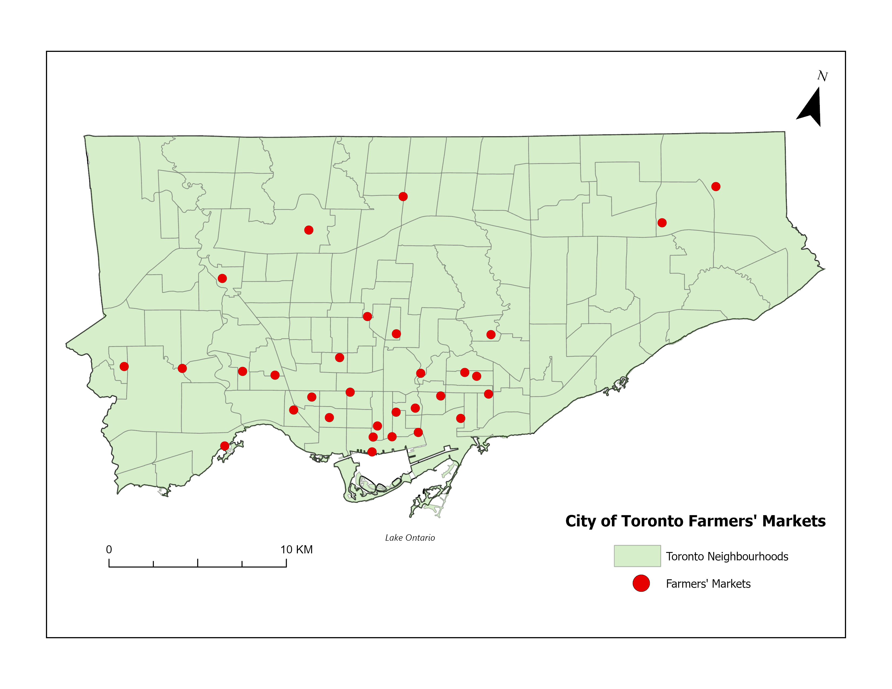

# toronto-farmers-markets
Digitizing Toronto's public and farmers markets with GIS

## Usage

The following map shows the layout of all digitized farmers markets in Toronto:

  

To open and explore the data:

- Load `farmersmarketTO.lpkx` in ArcGIS Pro
- Use the CSV or GeoJSON (`.json`) in any GIS tool or web map
- Use the PDF for sharing or presentation

## Data Sources & Attribution

This project uses data from:

- **City of Toronto Open Data Portal**  
  [https://open.toronto.ca](https://open.toronto.ca)
  
- **Toronto BoundaryT Feature Layer**  
  Source: [ArcGIS REST Service](https://services.arcgis.com/AtfpSdJcsnQiIRhL/arcgis/rest/services/Toronto_Boundary/FeatureServer)  
  Service Item ID: `3e0204e1d2fd4b97823151b419ea87c0`  
  Used for mapping context only;
  
> Attribution is maintained for all third-party datasets. All derived visualizations are provided for educational and non-commercial use.

## License

All original content in this repository is released under the **[CC0 1.0 Universal License](LICENSE)** (public domain dedication). You may copy, modify, distribute and use the work, even for commercial purposes, without asking permission.

